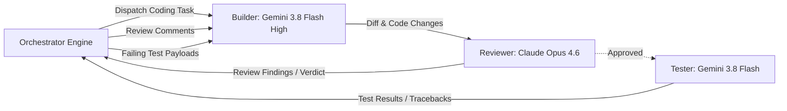

# Multi-Agent Triad Workflow: Builder, Reviewer & Tester

This directory contains the architecture, specifications, and prompt contracts for the automated multi-agent development workflow.

---

## Workflow Components

---

## Specifications

1. [`orchestrator.md`](file:///Users/krishnajammula/Development/Idp-ai/docs/agent-workflow/orchestrator.md)
   - State machine, loop termination guardrails (max 3 review & test cycles), token optimization rules, and inter-agent schemas.

2. [`builder-agent.md`](file:///Users/krishnajammula/Development/Idp-ai/docs/agent-workflow/builder-agent.md)
   - Model profile (Gemini 3.8 Flash High), surgical edit guidelines, handling Reviewer critique, and test failure patching.

3. [`reviewer-agent.md`](file:///Users/krishnajammula/Development/Idp-ai/docs/agent-workflow/reviewer-agent.md)
   - Model profile (Claude Opus 4.6), read-only review criteria, security & architecture audit dimensions, structured verdict schema.

4. [`tester-agent.md`](file:///Users/krishnajammula/Development/Idp-ai/docs/agent-workflow/tester-agent.md)
   - Unit test generation, pytest execution, test isolation with mocks, and structured failure traceback formatting.
