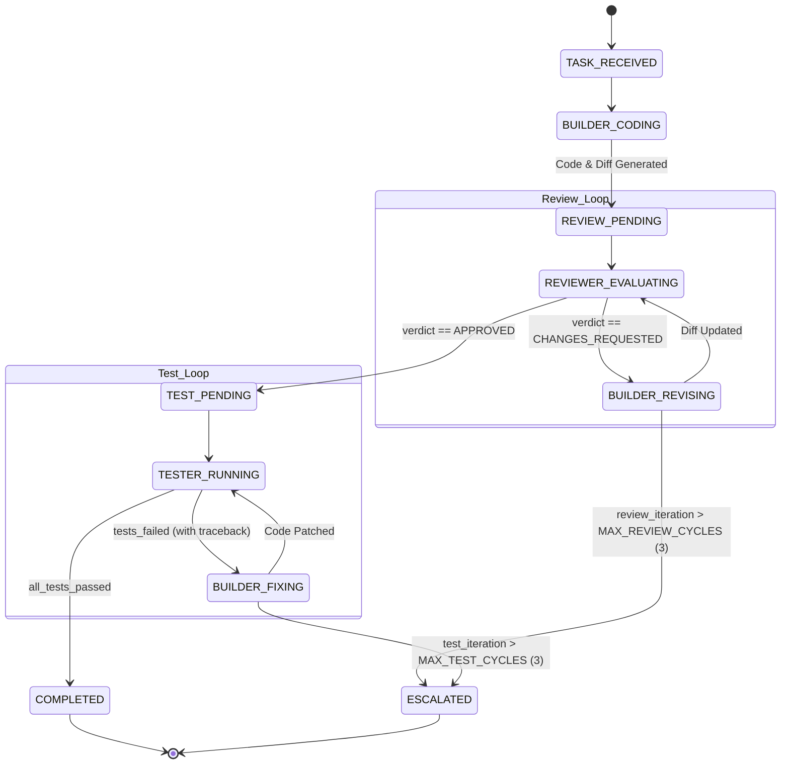

# Multi-Agent Workflow: Orchestrator Specification

## Overview

This document specifies the orchestration engine for the **Builder-Reviewer-Tester** multi-agent development workflow. The orchestrator coordinates execution across specialized LLM agents, enforces state transitions, manages loop termination guardrails, and optimizes token consumption via diff-based context passing.

---

## 1. Agent Roles & Model Assignments

| Agent | Assigned Model | Operational Mode | Primary Responsibility |
|---|---|---|---|
| **Builder** | Gemini 3.8 Flash (High reasoning) | Read / Write / Execute | Generates code, applies refactors, addresses review feedback, fixes test failures. |
| **Reviewer** | Claude Opus 4.6 | Read-only | Performs static diff analysis, architecture compliance, security review, and emits structured verdicts. |
| **Tester** | Gemini 3.8 Flash / Script runner | Read / Write (tests) / Execute | Generates unit tests, executes test suites, parses failure traces into structured error payloads. |

---

## 2. Orchestration State Machine



---

## 3. Loop Guardrails & Termination Boundaries

To prevent non-terminating loops and uncontrolled API cost, the orchestrator enforces strict circuit breakers:

| Guardrail | Threshold | Action upon Exceeding |
|---|---|---|
| **Max Review Iterations** | 3 cycles | Halt loop, output current diff + unaddressed critique, transition to `ESCALATED`. |
| **Max Test Fix Iterations** | 3 cycles | Halt loop, output pytest failure log + latest patch, transition to `ESCALATED`. |
| **Timeout per Step** | 180 seconds | Abort step, retry once with exponential backoff, escalate on repeated failure. |
| **Token Context Budget** | Diff-only for Reviewer | Truncate raw logs; Reviewer receives only `git diff` + affected spec lines. |

---

## 4. Inter-Agent Communication Contracts

All inter-agent data passing is governed by structured JSON schemas.

### A. Reviewer $\rightarrow$ Orchestrator Contract
```json
{
  "$schema": "http://json-schema.org/draft-07/schema#",
  "title": "ReviewerVerdict",
  "type": "object",
  "required": ["verdict", "review_summary", "issues"],
  "properties": {
    "verdict": {
      "type": "string",
      "enum": ["APPROVED", "CHANGES_REQUESTED"]
    },
    "score": {
      "type": "integer",
      "minimum": 1,
      "maximum": 10
    },
    "review_summary": {
      "type": "string"
    },
    "issues": {
      "type": "array",
      "items": {
        "type": "object",
        "required": ["severity", "file_path", "line_range", "description", "actionable_fix"],
        "properties": {
          "severity": {
            "type": "string",
            "enum": ["BLOCKER", "CRITICAL", "MAJOR", "MINOR"]
          },
          "file_path": { "type": "string" },
          "line_range": { "type": "string" },
          "description": { "type": "string" },
          "actionable_fix": { "type": "string" }
        }
      }
    }
  }
}
```

### B. Tester $\rightarrow$ Orchestrator Contract
```json
{
  "$schema": "http://json-schema.org/draft-07/schema#",
  "title": "TestResultPayload",
  "type": "object",
  "required": ["status", "total_tests", "passed", "failed", "failures"],
  "properties": {
    "status": {
      "type": "string",
      "enum": ["PASSED", "FAILED", "ERROR"]
    },
    "total_tests": { "type": "integer" },
    "passed": { "type": "integer" },
    "failed": { "type": "integer" },
    "duration_seconds": { "type": "number" },
    "failures": {
      "type": "array",
      "items": {
        "type": "object",
        "required": ["test_name", "file_path", "failure_reason", "traceback_summary"],
        "properties": {
          "test_name": { "type": "string" },
          "file_path": { "type": "string" },
          "failure_reason": { "type": "string" },
          "traceback_summary": { "type": "string" }
        }
      }
    }
  }
}
```

---

## 5. Token & Context Optimization Rules

1. **Diff-Centric Reviews**: Reviewer is never fed the entire codebase. It receives:
   - Task summary / user requirements.
   - `git diff` of changes made by Builder.
   - Referenced interface signatures (if applicable).
2. **Compact Test Feedback**: Builder receives only failing test cases, the assertion mismatch, and the relevant traceback lines (`--tb=short`), avoiding thousands of lines of passing test output.
3. **Stateless Sub-Invocations**: Each review iteration is provided with the *cumulative diff* plus previous actionable comments rather than maintaining multi-turn conversational bloat.

---

## 6. Execution Lifecycle Sequence

```text
1. User supplies Task Specification.
2. Orchestrator initializes state: review_cycle=0, test_cycle=0.
3. Orchestrator dispatches Task to BUILDER.
4. BUILDER edits codebase and generates git diff.
5. LOOP REVIEW (until APPROVED or review_cycle > 3):
   a. review_cycle += 1
   b. REVIEWER evaluates diff.
   c. If verdict == CHANGES_REQUESTED:
        BUILDER receives structured issues and refactors code.
      Else if verdict == APPROVED:
        BREAK to Test Stage.
6. LOOP TEST (until PASSED or test_cycle > 3):
   a. test_cycle += 1
   b. TESTER generates missing unit tests and executes test suite.
   c. If status == FAILED:
        BUILDER receives failing test payload and fixes implementation.
      Else if status == PASSED:
        BREAK to Completion.
7. Orchestrator outputs Final Report (Git commit SHA, review summary, test report).
```
